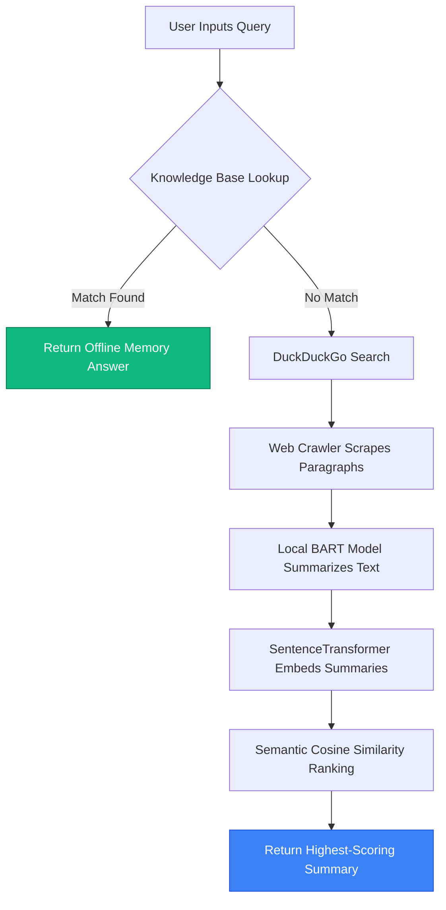

# 🤖 Webscrapper Bot: Local RAG Q&A Assistant

A completely free, local Retrieval-Augmented Generation (RAG) agent that answers user questions by searching the web, crawling article texts, summarizing search content, and semantic-ranking the findings. 

This project runs 100% locally using standard open-source Python libraries, local Hugging Face transformer pipelines, and DuckDuckGo Search APIs. **No API keys or paid accounts are required.**

---

## 📐 System Architecture (How it Works)

This bot implements the standard RAG pipeline locally:



1. **Query Input**: The user inputs a text question via the Streamlit interface.
2. **Knowledge Base (Offline Memory)**: The query is matched against a local dictionary of static answers first (immediate retrieval).
3. **Web Search**: If there is no local match, the bot queries DuckDuckGo for top-relevant links.
4. **Scraping**: The scraper crawls each page and extracts text content.
5. **Local Summarization**: A local BART model (`facebook/bart-large-cnn`) generates a summary for each scraped webpage.
6. **Semantic Ranking**: The query and summaries are converted into vector embeddings using a local `SentenceTransformer` model (`all-MiniLM-L6-v2`).
7. **Similarity Comparison**: Vector cosine-similarity is computed to select the summary most semantically aligned with the user query, and returned to the user.

---

## 🛠️ Step-by-Step Installation Tutorial

Follow these steps to run the bot locally on your machine:

### 1. Clone the Repository
Open your terminal and clone the repository:
```bash
git clone https://github.com/rajivchandak25/Webscrapper-bot.git
cd Webscrapper-bot
```

### 2. Set Up a Virtual Environment (Optional but Recommended)
Set up a clean environment to manage dependencies:
```bash
# Create environment
python -m venv venv

# Activate on Windows:
venv\Scripts\activate

# Activate on macOS/Linux:
source venv/bin/activate
```

### 3. Install Dependencies
Install the required packages:
```bash
pip install -r requirements.txt
```
> **Note**: This will download PyTorch, Streamlit, Transformers, and DuckDuckGo Search modules. It may take a few minutes as PyTorch packages are large.

---

## 🚀 How to Run the Bot

Launch the Streamlit web dashboard:
```bash
streamlit run app.py
```
After executing this, Streamlit will open a web interface in your default browser, typically at **`http://localhost:8501`**.

---

## 📖 Code Walkthrough & Tutorials

Here is an explanation of the core modules in the bot to help you understand the implementation:

### 1. The Entrypoint (`app.py`)
This file drives the Streamlit graphical interface:
```python
import streamlit as st
from bot import QABot

# Save bot instance in session state so it doesn't re-initialize on every refresh
if "bot" not in st.session_state:
    st.session_state.bot = QABot()

st.title("🤖 Q&A Bot")
query = st.text_input("Your question:", "")

if query:
    with st.spinner("Thinking..."):
        answer = st.session_state.bot.ask(query)
    st.write(answer)
```

### 2. The Crawler & Summarizer (`websearch.py`)
This module queries DuckDuckGo for links, crawls page paragraphs using BeautifulSoup, and uses the BART Seq2Seq model to compile summaries.
* **AutoTokenizer & AutoModelForSeq2SeqLM** are used to load BART locally.
* Inputs are truncated to `max_length=1024` tokens to avoid token-overflow constraints in BART.

### 3. The Semantic Reranker (`retriever.py`)
This module embeds the user query and the compiled summaries into vector spaces using `SentenceTransformer('all-MiniLM-L6-v2')` and ranks them via PyTorch Cosine Similarity:
```python
query_emb = self.embedder.encode(query, convert_to_tensor=True)
summary_embs = self.embedder.encode(summaries, convert_to_tensor=True)

# Calculate Cosine Similarity Matrix
scores = util.pytorch_cos_sim(query_emb, summary_embs)[0]
best_idx = scores.argmax().item()
return summaries[best_idx]
```

### 4. Customizing the Local Knowledge Base (`knowledge_base.py`)
You can add predefined answers to bypass web searches. Open `knowledge_base.py` and modify the dictionary:
```python
self.data = {
    "hello": "Hi there! How can I help you?",
    "who are you": "I am a simple Q&A bot built using Python and Hugging Face.",
    "your custom query": "Your custom preset response goes here!"
}
```
