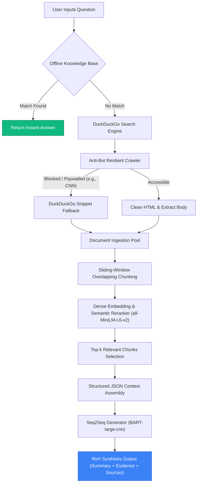

# Local RAG Q&A Assistant: Anti-Bot Web Scraper & Transformer Pipeline

A completely free, 100% local Retrieval-Augmented Generation (RAG) assistant that queries the web, bypasses anti-scraping paywalls, performs sliding-window overlapping chunking, reranks passages with dense embeddings, and synthesizes comprehensive answers (up to 1,500 characters) using local Hugging Face transformer models.

**Runs entirely on your machine. No API keys, accounts, or paid services required.**

---

## System Architecture & Pipeline Stages

This project demonstrates a multi-stage LLM/RAG pipeline designed to run efficiently on local hardware:


```mermaid
flowchart TD
    A["User Inputs Question"] --> B{"Offline Knowledge Base"}
    B -- "Match Found" --> C["Return Instant Answer"]
    B -- "No Match" --> D["DuckDuckGo Search Engine"]
    D --> E["Anti-Bot Resilient Crawler"]
    E -- "Blocked / Paywalled (e.g., CNN)" --> F["DuckDuckGo Snippet Fallback"]
    E -- "Accessible" --> G["Clean HTML & Extract Body"]
    F --> H["Document Ingestion Pool"]
    G --> H
    H --> I["Sliding-Window Overlapping Chunking"]
    I --> J["Dense Embedding & Semantic Reranker (all-MiniLM-L6-v2)"]
    J --> K["Top-k Relevant Chunks Selection"]
    K --> L["Structured JSON Context Assembly"]
    L --> M["Seq2Seq Generator (BART-large-cnn)"]
    M --> N["Rich Synthesis Output (Summary + Evidence + Sources)"]

    style C fill:#10b981,stroke:#047857,color:#ffffff
    style N fill:#3b82f6,stroke:#1d4ed8,color:#ffffff
```

---

## Key Engineering Innovations & Academic Showcase

### 1. Anti-Bot Defense & Paywall Immunity
* **The Problem:** Modern news and corporate sites (such as CNN, Bloomberg, and Reuters) block basic web scrapers with HTTP `401`/`403` status codes or serve paywall / login gates (*"Please sign in to continue"*). Naive scrapers mistake these short login notices for actual page content.
* **The Solution:** 
  - Realistic browser header spoofing (`User-Agent`, `Sec-Ch-Ua`, `Accept-Language`, `Sec-Fetch-*`).
  - Strict HTTP `200` status verification.
  - Heuristic pattern matching against bot challenges, login gates, and cookie modals.
  - **Zero-Drop Search Snippet Fallback:** If a site blocks direct scraping, the crawler automatically falls back to DuckDuckGo's pre-extracted search snippet (`body`), ensuring the pipeline never fails or returns login prompts.

### 2. Overlapping Sliding-Window Chunking (`chunker.py`)
* Instead of naive document slicing or arbitrary character cuts, documents are processed using a sliding window with configurable word overlap (e.g., 180 words per chunk with 40 words overlap).
* This preserves semantic context and entity relationships that span across sentence boundaries, preventing critical information loss at chunk edges.

### 3. Dense Vector Retrieval & Semantic Reranking (`retriever.py`)
* Employs `sentence-transformers/all-MiniLM-L6-v2` as a local bi-encoder.
* Maps user queries and candidate chunks into a shared 384-dimensional dense vector space.
* Uses PyTorch cosine similarity to rerank all generated chunks, discarding irrelevant noise and selecting only the top-$k$ highest-confidence passages.

### 4. Structured JSON Context Formatting (`generator.py`)
* Retrieved passages are organized into an explicit, structured JSON schema (`{"query": ..., "passages": [...]}`) before prompt assembly.
* Provides clear provenance and unambiguous source separation, reducing hallucinations and enabling smoother summarization.

### 5. High-Density Abstractive Generation & Source Attribution
* Uses `facebook/bart-large-cnn` to synthesize comprehensive answers (up to 1,500 characters).
* Combines the abstractive transformer summary with key evidence quotes from the top-ranked passage and clickable Markdown source links.

---

## Project Structure

```
Webscrapper-bot/
├── app.py              # Streamlit Web UI with interactive Pipeline Inspector
├── bot.py              # Master RAG pipeline orchestrator
├── chunker.py          # Sliding-window overlapping text chunker
├── generator.py        # Structured JSON prompt formatter & Seq2Seq generator
├── knowledge_base.py   # Offline memory dictionary for instant retrieval
├── main.py             # Interactive CLI entrypoint
├── requirements.txt    # Project dependencies (100% free / open source)
├── retriever.py        # Dense embedding & semantic reranker (all-MiniLM-L6-v2)
├── websearch.py        # DuckDuckGo search & anti-bot resilient web scraper
└── README.md           # System documentation & tutorials
```

---

## Installation & Setup

### 1. Clone the Repository
```bash
git clone https://github.com/rajivchandak25/Webscrapper-bot.git
cd Webscrapper-bot
```

### 2. Set Up a Virtual Environment (Recommended)
```bash
# Create virtual environment
python -m venv venv

# Windows:
venv\Scripts\activate

# macOS / Linux:
source venv/bin/activate
```

### 3. Install Dependencies
```bash
pip install -r requirements.txt
```

---

## How to Run

### Option A: Streamlit Web Dashboard (Recommended)
Launch the graphical interface with full pipeline inspection:
```bash
streamlit run app.py
```
* Open your browser at `http://localhost:8501`.
* Expand the **Pipeline Inspection** section under any answer to observe the exact scraping status, overlapping chunks, dense similarity scores, and structured JSON context!

### Option B: Terminal Command-Line Interface
Run the interactive CLI:
```bash
python main.py
```

---

## Technologies Used
* **Python 3.10+**
* **Streamlit** (Web application and interactive inspector)
* **PyTorch & Hugging Face Transformers** (`facebook/bart-large-cnn`)
* **Sentence-Transformers** (`all-MiniLM-L6-v2`)
* **BeautifulSoup4 & Requests** (DOM parsing and session scraping)
* **DuckDuckGo Search (`ddgs`)** (Free search engine API)
